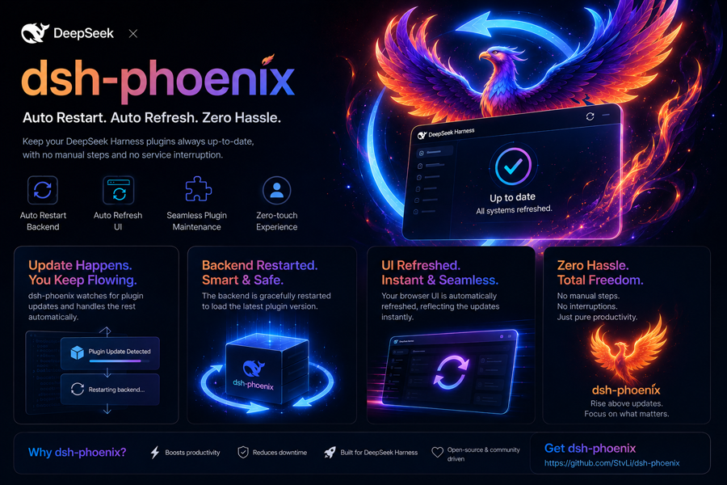

# 🐦 dsh-phoenix

### Never-interrupt, resumable lifecycle for DeepSeek Harness (dsh)

`dsh-phoenix` is a persistent [DeepSeek Harness](https://github.com/deepseek-ai/deepseek-harness) host plugin that turns **"plugin update → restart dsh"** from a disruptive break into a **graceful, seamless, resumable loop** — so a running task finishes, the browser keeps up, and a long-running objective resumes and keeps evolving across restarts.

<p align="center"></p>

**English** · [中文版](./README.zh.md)

<p>
  <a href="https://github.com/StvLi/dsh-phoenix"></a>
  <a href="https://www.npmjs.com/package/dsh-phoenix"></a>
  <a href="https://github.com/StvLi/dsh-phoenix/blob/main/LICENSE"></a>
  <a href="https://github.com/topics/dsh-plugin"></a>
  
  
</p>

---

## Why you need it

DeepSeek Harness is "everything is a plugin," and a dsh Web is a single long-running process managed by *systemd*. That creates three painful realities:

| Pain | What dsh-phoenix does |
| --- | --- |
| Updating a plugin means hard-restarting dsh, **cutting off whatever is running** | **Gracefully restarts** — waits until no agent is turning, so the current task finishes before the reboot. |
| After a backend restart the browser page **drops its connection and freezes** ("stopped") | **Auto-reconnects** — a tiny injected heartbeat reloads the page the moment the backend returns. |
| A restart destroys in-memory goal state, so an objective **cannot continue across restarts** | **Re-arms the goal** — after the reboot it re-activates a disarmed goal so a long-running objective resumes and keeps evolving. |

---

## ✨ Features

### 1. Graceful restart — reboots only when it's safe
- Detects a plugin **(re)activation** through the dsh plugin tools (`cordis_run`) and **does not** restart immediately.
- Checks every live agent (including sub-agents): if any is `running`, it **defers** and re-checks every few seconds, restarting only when the agent goes **idle** (a 5-minute cap prevents a never-restart).
- Runs the restart through `systemd-run --user` as an **independent transient unit**, so even the process being restarted survives until the reboot completes.
- React only to `cordis_run` — client bundle source edits that dsh's own HMR reloads are not `cordis_run` operations, so they do **not** trigger a dsh-phoenix reboot.

### 2. Client auto-reconnect — the page keeps up with the backend
- Registers a `/__dsh_health` endpoint that returns a **per-boot token**.
- Injects a **zero-dependency heartbeat** into the served index: every few seconds it polls `/__dsh_health`; when the token changes (the backend restarted), the page **reloads itself**.
- No more "frozen / stopped" page. Backend restarts become invisible.

### 3. Cross-restart goal re-arm — a task keeps evolving
- Goals are durable (session-log backed), but dsh disarms an active goal on every restart, so automatic continuation stops.
- `dsh-phoenix` reads a **persistent checkpoint** (a JSON state file); when it says `pendingResume: true`, it finds the live agent's *active + disarmed* goal and calls `goals.resume()` to **re-arm** it.
- Re-armed, the harness's goal round driver continues driving the next iteration.

### 🧬 The whole point: a self-evolving loop
Combine the three and you get a **cross-restart autonomous evolution loop** (reproducible steps in [docs/VERIFY.md](docs/VERIFY.md)):

```
read checkpoint → decide next step → test / modify the plugin
  → write checkpoint (pendingResume) → graceful restart
  → dsh boots → dsh-phoenix re-arms the goal → next round … until done
```

The checkpoint is the loop's durable memory; the goal is its driver; the re-arm hook is its resurrection point.

---

## 🆚 How this is different

| Project | Focus | dsh-phoenix adds |
| --- | --- | --- |
| [dsh-doctor](https://github.com/d86e/dsh-doctor) | Self-healing *startup*: recover from plugin-induced boot failures, doctor runs, stuck-turn detection | **Idle-aware graceful restart** (never interrupt a running task), **client auto-reconnect**, **goal continuation** |
| [dsh-daemon](https://github.com/chenkai2/dsh-daemon) | Register dsh web as an auto-start self-healing *background service* | The **resumable, self-evolving lifecycle** on top of the process that's already there |

dsh-doctor and dsh-daemon heal the *launch*; **dsh-phoenix makes the *lifetime* graceful, connected, and resumable.** They are complementary — dsh-phoenix sits comfortably on top of a dsh-daemon-managed process.

### Complement, not a competitor — two axes, one leak-proof layering

"phoenix" and "hot" often read as rivals — both are "about plugin updates," both so a change takes effect. That reading mistakes the system. A dsh process has **two independent axes**, and each family owns one.

#### Axis 1 · the composition (what dsh is made of)
dsh is a Cordis *composition*: a tree of plugin rows produced by diffing patch layers. It is applied at boot but **not frozen** — rows can be added, removed or swapped **live** through the loader's diff mechanism. dsh's own HMR (`cordis-plugin-hmr`) already hot-reloads this, but it *deliberately ignores `node_modules`*, so **upgrading an already-installed plugin package still needs a restart** — that is exactly the gap the hot family fills.

The **hot family owns this axis**. When you `dsh plugin add/remove/update` a bundle from the CLI, [`dsh-hot-installer`](https://github.com/KYinCode/dsh-hot-installer) watches the profile manifest (`dsh.profile.bundles`) and [`dsh-hot-reload`](https://github.com/stuarthu/dsh-hot-reload) watches `pnpm-lock.yaml`. They drive the *same boot-time mount path* live: resolve the package, read its `dsh.bundle.patch`, inject the rows into the running tree, re-import the new module (cache invalidation + fiber re-instantiation). On failure they **roll back** to the working version and flag "a restart is needed." They never touch the process — **they never restart dsh.**

#### Axis 2 · the process lifecycle
Some things are **not** composition rows; they live at the process boundary: the systemd user unit and its cgroup, the HTTP/WebSocket server, the in-memory goal activation, the browser's live connection. **None of these hot-swap.** When a reset crosses them, the honest action is a restart — and **that restart is what dsh-phoenix owns.**

dsh-phoenix makes it **graceful** (idle-aware — it waits until no agent is turning), **connected** (an injected heartbeat reloads the browser when the boot token changes), and **resumable** (it re-arms a disarmed goal so a long-running objective continues). It also runs the reboot via `systemd-run --user` as a **detached transient unit**, so the process being killed never drags the restart sequence down with it.

#### The boundary falls out of the two axes
They are disjoint because they trigger on **different change paths**, and each is the correct tool for the axis it owns:

| Change path | Axis | Handler | dsh-phoenix restart? |
| --- | --- | --- | --- |
| `dsh plugin add/remove/update` (CLI, installed bundle) | composition | hot family → live mount / reload | **No** |
| Plugin tree changed via the dsh **cordis tools** (`cordis_run`) | composition (runtime, agent-driven) | dsh-phoenix | **Yes**, gracefully |
| A hot swap **fails** (bad import / `apply` throws) | composition | hot family rolls back and **flags** "restart needed" | dsh-phoenix makes that restart safe |

So it is not "who wins the same change" but **prevent at the source, catch the leak**: the hot family eliminates the *avoidable* restarts at the change entry; dsh-phoenix is the layer beneath that guarantees the *remaining, genuine* restarts never interrupt work, drop the browser, or kill an in-flight objective. That is a classic layered-systems separation, not a rivalry.

> [!NOTE]
> **This is a statement about current behavior, not a guarantee.** Today `dsh-hot-installer` / `dsh-hot-reload` watch the profile manifest and lockfile and do **not** react to `cordis_run`; dsh-phoenix watches `tools/result` and does **not** watch the manifest. If either side later widens its trigger, re-check this table — the boundary is behavioral, not architectural.

---

## 🧭 Durable lifecycle & safe-restart semantics

The restart → recovery → resume path is an explicit, **durable** state machine. State is persisted to `DSH_PHOENIX_STATE_FILE` **atomically** (`.tmp` + `rename`), so it survives a crash at any point, and a bad/missing checkpoint can never trigger a spurious resume.

### States

```
 IDLE ──restart requested──▶ DEFERRED ──safe point / deadline──▶ RESTARTING ──boot / crash──▶ RECOVERING ──resume──▶ RUNNING
   ▲                                                                                                              │
   └────────────────────────────── new request (coalesced while in-flight) ◀──────────────────────────────────────┘
```

| State | Meaning |
| --- | --- |
| `idle` | no pending restart |
| `deferred` | restart requested but an agent is running; waiting for a safe point |
| `restarting` | the reboot is scheduled (`systemd-run`) |
| `recovering` | booted after a restart/crash; bounded, idempotent resume of the recorded goal |
| `running` | settled; no stale pending restart |

### Transitions & invariants

- `idle`/`running` — *restart requested* → `deferred` (busy) or `restarting` (idle); a new `generation` is minted.
- `deferred` — *safe point* → `restarting`; *hard safety deadline* → `restarting` (forced, logged).
- `restarting` — *boot / crash* → `recovering`.
- `recovering` — *resume, at most once* → `running`.

**Invariants**
- `RESTARTING`: no second restart may be scheduled (requests coalesce).
- `RECOVERING`: resume is attempted only for the recorded `generation`; a **stale** `goalId` (no matching live goal) is invalidated, never resumed.
- `RUNNING`: no stale `pendingResume` may remain active.

### Resume semantics — persistent continuation

`pendingResume` is not a loose boolean; the checkpoint also records `generation`, `goalId` and `resumeAttempt`. A **marked** goal is a continuation target: dsh-phoenix re-resumes it **after every restart** (at-most-once *per restart/generation*) while it stays active. Before calling `goals.resume()` the plugin **durably increments** `resumeAttempt` (atomic write), so a crash mid-resume cannot resume the same goal twice for the same restart. The continuation is **kept** (`goalId`/`pendingResume` persist) until the goal completes, becomes stale, or `resumeAttempt` is exhausted (`maxResumeAttempts`) — which both stops the loop and lets the goal live across many restarts.

### Safety deadline, not "restart now regardless"

The defer timeout is a **deadline with escalation**, not an unconditional timer:

```
deferred (agent busy)
  ├─ soft deadline  → log a WARNING (agent still busy)
  └─ hard deadline  → if policy is 'auto', force the restart (logged)
                       if policy is 'wait', keep waiting (no forced restart)
```

`DSH_PHOENIX_DEFER_POLICY=auto` (default) preserves the protection against infinite defer; `wait` removes forced restarts (you accept a possibly-long defer). **Phoenix cannot distinguish "agent busy" from "agent is in a critical section"** — DSH exposes no such signal — so busy is treated as unsafe-to-restart, and the deadline is the safety valve.

### Acceptance answers

1. **Crash at every point?** The durable state survives; on boot a mid-cycle state (`deferred`/`restarting`/`recovering`) moves to `recovering` and settles idempotently.
2. **Same goal resumed twice [in one restart]?** No — at-most-once per restart/generation (`resumeAttempt` incremented durably *before* the call). A marked goal is re-resumed on each subsequent restart (intended continuation).
3. **Stale checkpoint triggers a resume?** No — a missing/corrupt checkpoint collapses to `idle`; a `goalId` that matches no live goal is invalidated, not resumed.
4. **Repeated update events → repeated restarts?** No — in-flight requests coalesce; duplicate events produce one restart.
5. **Infinite restart/resume loop?** No — in-flight coalescing, resume-attempt cap, and settle-to-`running` on failure/exhaustion.
6. **Defer deadline expires while busy?** Soft → warning; hard → force (if `auto`) or keep waiting (if `wait`), all logged.
7. **Busy vs critical section?** Phoenix cannot tell (DSH exposes no critical-section signal); it treats busy as unsafe and bounds it with the safety deadline.
8. **Transitions deterministic & testable?** Yes — the state machine is pure functions; see `tests/` (17 tests incl. crash/stale/duplicate/failure injection).

---

## 📦 Requirements

> [!WARNING]
> **The graceful-restart feature requires dsh to run as a `systemd --user` service** (default unit `dsh-web`). On other setups — macOS, containers without systemd, or `pnpm run dev:web` — the restart is the one feature that cannot work. On those, either set `DSH_PHOENIX_RESTART_CMD` to a command that restarts your dsh process, or accept that only **client auto-reconnect** and **goal re-arm** are active. The plugin detects this at startup and logs `graceful restart DISABLED` so it never *silently* fails.

- A DeepSeek Harness `dsh` installation whose Web runs as a **systemd --user service** (default unit `dsh-web`).
- Node `>= 22`.
- **Zero external dependencies** — the plugin uses only dsh's own runtime services (`timer`, `webServer`, `agents`, `goals`, `shell`).

---

## 🚀 Installation

`dsh-phoenix` is an official dsh **bundle** (it declares `dsh.bundle`), so it installs with the standard tooling.

**From npm (recommended)**

```sh
dsh plugin --profile <profile> add dsh-phoenix
```

**From git / tarball**

```sh
# git (needs a prepare build + allowBuilds on pnpm >= 10)
dsh plugin --profile <profile> add github:StvLi/dsh-phoenix

# tarball (pack once; the filename follows the package version, so read it back)
TARBALL=$(npm pack 2>/dev/null | tail -1)   # e.g. dsh-phoenix-0.2.6.tgz
dsh plugin --profile <profile> add "$TARBALL"
```

Then verify the layer and start:

```sh
dsh --profile <profile> --dump-config   # expect a "# == dsh-phoenix" layer
dsh --profile <profile>
```

Once installed, the row is injected automatically (see `cordis.patch.yml`):

```yaml
- insert:
    - id: dsh-phoenix
      name: dsh-phoenix
```

---

## ⚙️ Configuration

All knobs are environment variables with safe defaults — no configuration file required.

| Env | Default | Purpose |
| --- | --- | --- |
| `DSH_PHOENIX_UNIT` | `dsh-web` | systemd user unit to restart |
| `DSH_PHOENIX_DELAY` | `8` | seconds between `stop` and `start` |
| `DSH_PHOENIX_ARMING_MS` | `5000` | ignore signals for N ms after load (prevents self-trigger) |
| `DSH_PHOENIX_DEBOUNCE_MS` | `3000` | collapse burst signals into one reboot |
| `DSH_PHOENIX_DEFER_POLL_MS` | `3000` | idle re-check interval while deferring |
| `DSH_PHOENIX_DEFER_SOFT_MS` | `300000` | soft safety deadline — log a warning at this point, keep waiting |
| `DSH_PHOENIX_DEFER_HARD_MS` | `900000` | hard safety deadline — force the restart (if policy is `auto`) |
| `DSH_PHOENIX_DEFER_POLICY` | `auto` | `auto` (force at hard deadline) or `wait` (never force; may defer indefinitely) |
| `DSH_PHOENIX_HEALTH_MS` | `4000` | browser heartbeat interval |
| `DSH_PHOENIX_RESTART_CMD` | *(empty)* | custom restart command override for non-systemd deployments (see the Requirements warning) |
| `DSH_PHOENIX_REARM_MS` | `8000` | boot delay before the lifecycle recovery/resume check |
| `DSH_PHOENIX_MAX_RESUME_ATTEMPTS` | `1` | resume attempts per restart (1 = one resume per restart; >1 retries; reaching it ends the continuation) |
| `DSH_PHOENIX_STATE_FILE` | *(empty)* | path to the durable lifecycle checkpoint; empty disables the lifecycle |

---

## 🧠 How it works

- **Detect** — subscribes to `tools/result` and reacts to a plugin **(re)activation** (`cordis_run`).
- **Defer** — if any agent is `running`, hold the restart and re-check until idle (or the cap).
- **Reboot** — `systemd-run --user` schedules `stop → sleep → start`, decoupled from the dsh cgroup.
- **Reconnect** — the health endpoint + injected heartbeat reload the page when the boot token changes.
- **Resume** — on boot, reads the checkpoint; if `pendingResume`, re-arms the disarmed goal via `goals.resume()`.

Everything logs `[dsh-phoenix]` to the dsh journal for easy inspection.

---

## ✅ Verify it works

The claims in this README are backed by a reproducible checklist in
**[docs/VERIFY.md](docs/VERIFY.md)** and a unit-test suite (`npm test`, 10
tests). Quick start:

```sh
npm test                                  # 21 tests: state machine transitions, persistent continuation, stale/corrupt checkpoint, coalescing, defer escalation

# after a real plugin update, watch the journal:
journalctl --user -u dsh-web -f | grep dsh-phoenix
# you should see "deferring (agent busy)" then, at idle, "executing deferred restart"
# and, after the reboot, "re-armed goal after resume (rev=N)"
```

`curl http://127.0.0.1:3080/__dsh_health` should return `{"token":"…"}`.

---

## 📄 License

[MIT](./LICENSE) © [Steven P.LI](https://github.com/StvLi)
